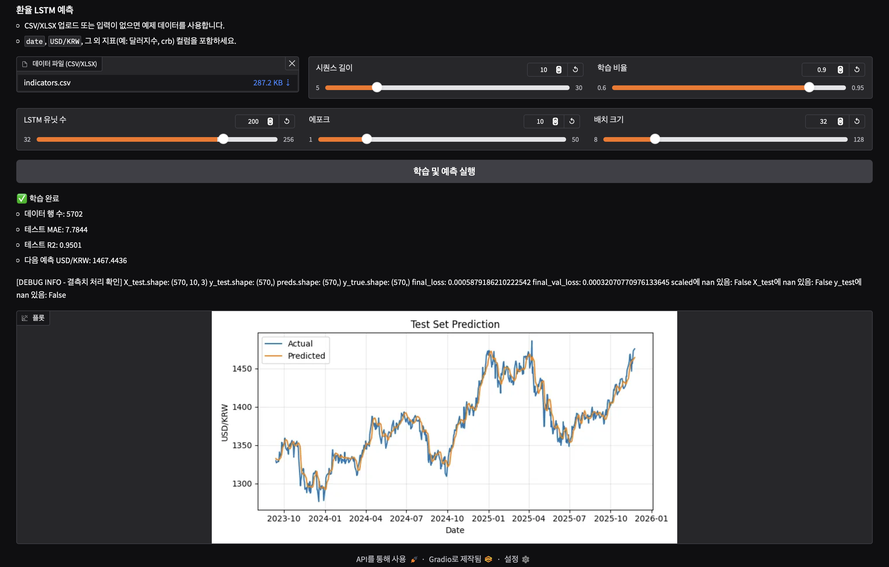

# FX-Forecasting-with-LSTM

[](https://www.python.org/)
[](https://www.tensorflow.org/)
[](https://gradio.app/)
[](https://pandas.pydata.org/)
[](https://numpy.org/)
[](https://matplotlib.org/)

## Project Description

This project develops a machine learning model to predict USD/KRW exchange rates using Long Short-Term Memory (LSTM) neural networks. By analyzing various economic indicators such as the US Dollar Index (DXY) and Commodity Research Bureau (CRB) index, the model forecasts future exchange rate movements.

The project includes:
- **Data Collection**: Automated scraping of economic indicators from financial websites
- **Data Preprocessing**: Time series alignment, missing value handling, and feature scaling
- **Model Training**: LSTM-based forecasting with hyperparameter tuning
- **Web Interface**: Interactive Gradio app for model training and prediction visualization
- **Evaluation**: Performance metrics including MAE and R² score

## Features

- Real-time economic data collection from multiple sources
- LSTM model training with customizable parameters
- Interactive web interface for easy model deployment
- Comprehensive data preprocessing pipeline
- Visualization of prediction results

## Installation

1. Clone the repository:
```bash
git clone https://github.com/ganjjiang/FX-Forecasting-with-LSTM.git
cd FX-Forecasting-with-LSTM
```

2. Create a virtual environment and activate it:
```bash
python -m venv venv
source venv/bin/activate  # On Windows: venv\Scripts\activate
```

3. Install dependencies:
```bash
pip install -r requirements.txt
```

## Usage

### Data Collection
```bash
python src/fx_forecasting/data_collection.py
```

### Run the Gradio Web App
```bash
python src/fx_forecasting/gradio_app.py
```

### Run Tests
```bash
pytest tests/
```

## Project Structure

```
├── src/
│   └── fx_forecasting/
│       ├── __init__.py
│       ├── data_collection.py    # Data scraping and collection
│       ├── preprocessing.py      # Data cleaning and preprocessing
│       ├── modeling.py          # LSTM model implementation
│       └── gradio_app.py        # Web interface
├── tests/                       # Unit tests
├── screenshots/                 # Screenshots of the application
├── requirements.txt             # Python dependencies
└── README.md                    # Project documentation
```

## Technologies Used

- **Python 3.8+**
- **TensorFlow/Keras**: For LSTM model implementation
- **Gradio**: Web interface for model interaction
- **Pandas & NumPy**: Data manipulation and analysis
- **Matplotlib**: Data visualization
- **Scikit-learn**: Data preprocessing
- **Requests & BeautifulSoup**: Web scraping

## Background

Exchange rates play a crucial role in international trade and financial transactions. However, exchange rates are difficult to predict and tend to be volatile, making prediction increasingly necessary. There are various methods for prediction, but machine learning-based approaches have gained attention recently. Therefore, this project aims to develop an exchange rate prediction model using machine learning algorithms.

## Project Objectives
- **Exchange Rate Prediction Model Development**: Develop and evaluate an exchange rate prediction model using machine learning algorithms.
- **Identification of Predictive Variables**: Identify which variables have the most significant impact on exchange rate prediction, assuming various variables influence it.
- **Model Interpretation**: Analyze the developed model to understand how each variable affects exchange rate prediction.

## Analysis Procedure

1. **Exchange Rate Characteristics Analysis**: Identify changes in factors affecting exchange rate fluctuations and analyze the impact of these changes.
2. **Economic Indicators Analysis**: Analyze economic indicators related to exchange rates (such as real GDP, inflation, imports/exports) to understand their relationship with exchange rates.
3. **Data Collection**: Visualize collected data to discover various insights and utilize them for reports and presentations.
4. **Data Preprocessing**: Collect, clean, and extract necessary data for optimal preprocessing.
5. **Data Analysis**: Analyze correlations between collected data to select variables for the final model.
6. **Model Creation**: Fine-tune parameters with selected variables to find the minimum error value.

## Screenshots



## Key Analysis Features
### Data Collection
- Web scraping for exchange rate information using Requests, Selenium, and Beautiful Soup
### Data Preprocessing
- Time stamp alignment using Pandas library
- Other data preprocessing using scikit-learn
### Data Analysis
- Pattern recognition in time series data using combined models such as ARIMA and Linear Regression
- Model performance improvement through hyperparameter tuning and cross-validation
- Visualization of model prediction results using matplotlib, seaborn, etc.

# Reference Project and Data

## Data Collection Results & Variable Information
[Variable Definition Document](https://drive.google.com/file/d/1Z9AiCpSk4J18TB8ZNDzlfCD1_RycqtTm/view?usp=drive_link)

## Data Collection & Merge Results .Xlsx
[Data Collection & Merge Results](https://docs.google.com/spreadsheets/d/14yVyN6oG2umclZfPiCliIeosqULaqW2F/edit?usp=drive_link&ouid=109969025433946755539&rtpof=true&sd=true)

## Data Analysis PPT
[Presentation PPT](https://drive.google.com/file/d/1U3wUtxpbSYHml1eDXpqzKvp6Hcfzx-Kc/view?usp=drive_link)

## Sources
Korea Capital Market Institute https://www.kcif.or.kr/front/board/boardList.do?intSection1=2&intSection2=4&intBoardID=1 <br>
Bank of Korea Economic Statistics System http://ecos.bok.or.kr <br>
IMF http://www.imf.org/en/data <br>
World Bank https://data.worldbank.org <br>
BIS https://www.bis.org/ <br>
Economic Policy Uncertainty http://www.policyuncertainty.com/ <br>
Bloomberg, CEIC <br>
Ministry of Trade, Industry and Energy https://www.motie.go.kr/motie/py/sa/investstatse/investstats.jsp <br>
Real-time exchange rate data, Investing.com <br>
Financial data Yahoo Finance <br>
Quandl for various fields including finance, economy, and politics <br>
Federal Reserve Economic Data FRED <br>
Monthly exchange rate information Korea Financial Investment Association (KOFIA) <br>


## 📞 문의하기

**개발 관련 컨설팅 및 외주 받습니다.**

### 👨‍💼 프로젝트 관리자 연락처

**Email**: [hyun.lim@okkorea.net](mailto:hyun.lim@okkorea.net)  
**Homepage**: [https://www.okkorea.net](https://www.okkorea.net)  
**LinkedIn**: [https://www.linkedin.com/in/aionlabs/](https://www.linkedin.com/in/aionlabs/)  

### 🛠️ 전문 분야

- **IoT 시스템 설계 및 개발**
- **임베디드 소프트웨어 개발** (Arduino, ESP32)
- **AI 서비스 개발** (LLM, MCP Agent)
- **클라우드 서비스 구축** (Google Cloud Platform)
- **하드웨어 프로토타이핑**

### 💼 서비스

- **기술 컨설팅**: IoT 프로젝트 기획 및 설계 자문
- **개발 외주**: 펌웨어부터 클라우드까지 Full-stack 개발
- **교육 서비스**: 임베디드/IoT 개발 교육 및 멘토링

