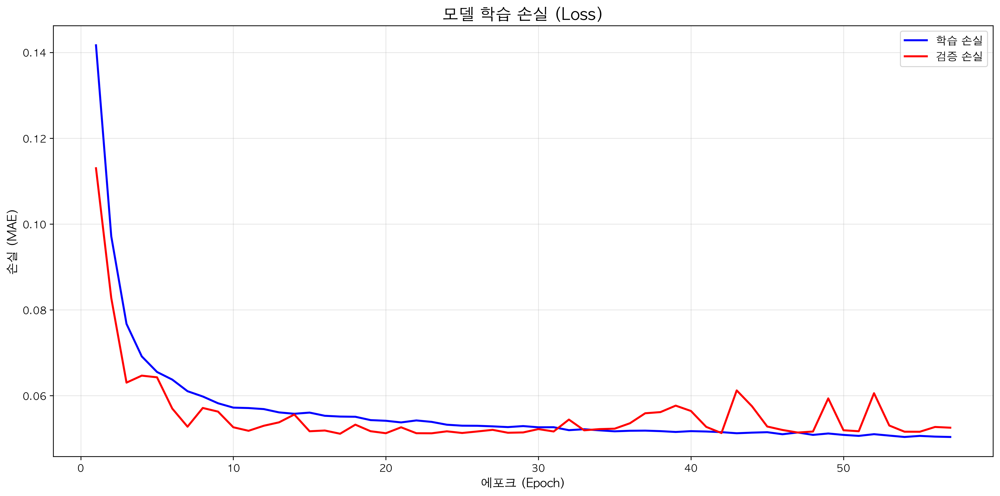
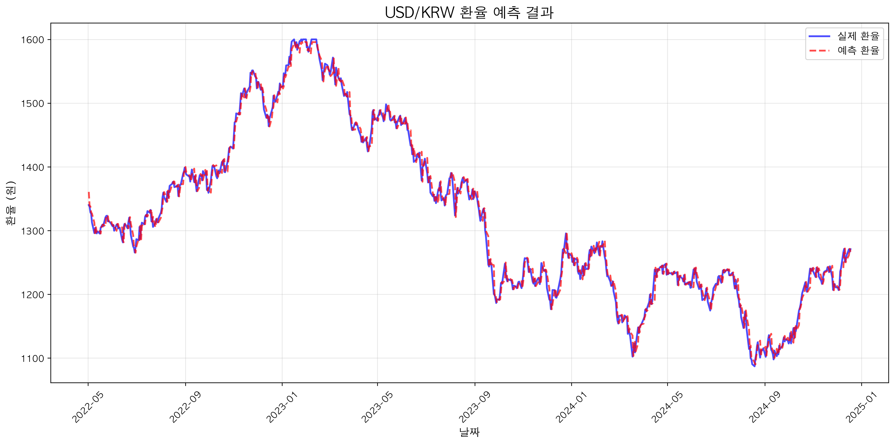
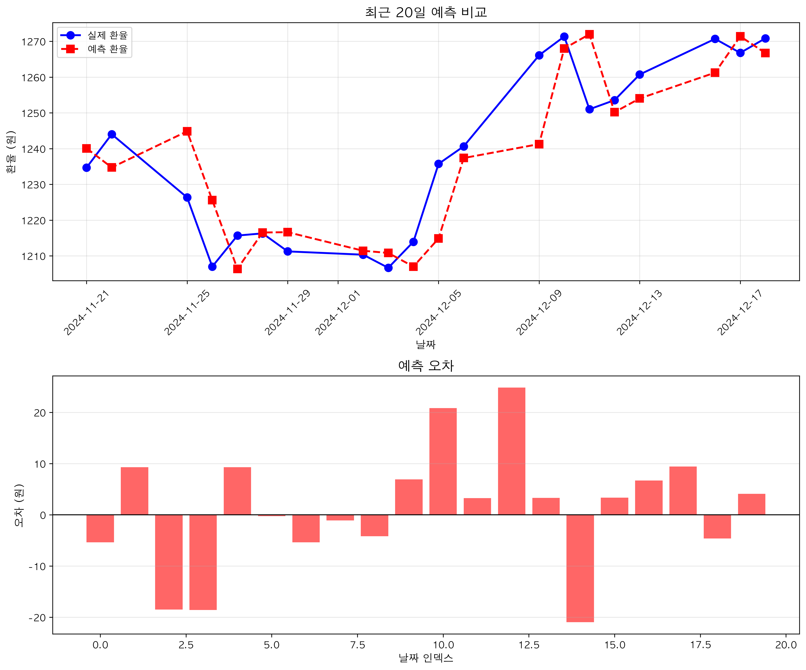
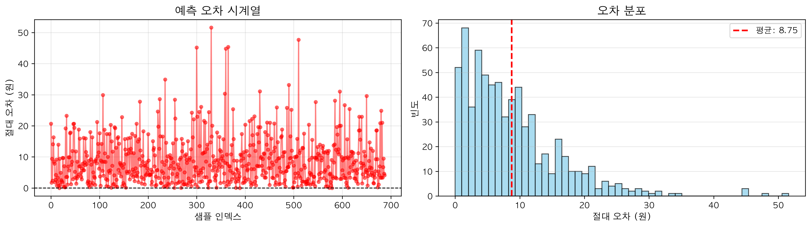
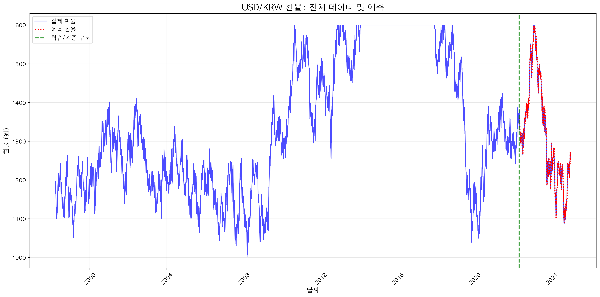
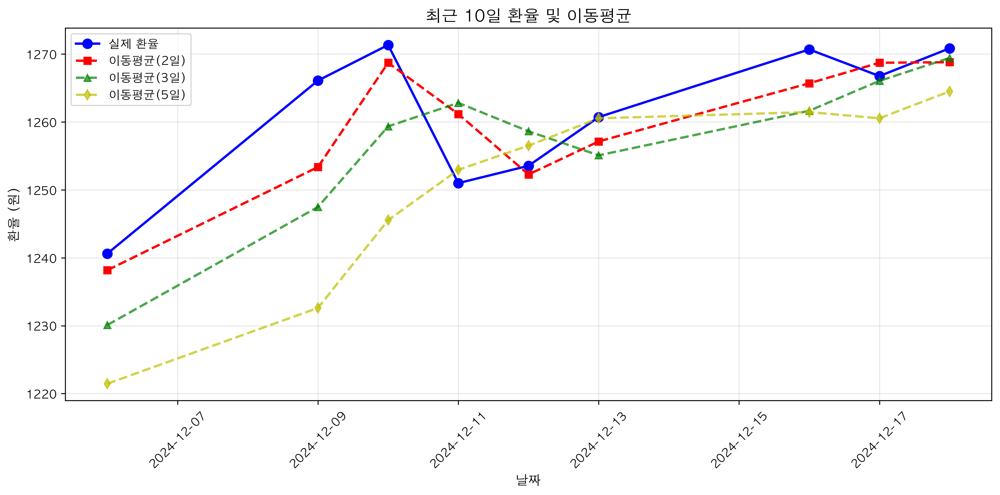

# Finance Projects - Exchange Rate Forecasting with LSTM 💹

[](https://www.python.org/)
[](https://www.tensorflow.org/)
[](https://gradio.app/)
[](https://pandas.pydata.org/)
[](https://numpy.org/)
[](https://matplotlib.org/)
[](https://scikit-learn.org/)
[](#-license)

This repository contains two USD/KRW exchange rate forecasting projects using LSTM neural networks.

## 📋 Table of Contents

- [Project Overview](#-project-overview)
- [Project 1: FX-Forecasting-with-LSTM](#-project-1-fx-forecasting-with-lstm)
- [Project 2: fx-lstm-analysis](#-project-2-fx-lstm-analysis)
- [Project Comparison](#-project-comparison)
- [Learning Resources](#-learning-resources)
- [Development Environment](#️-development-environment)
- [Disclaimer](#️-disclaimer)
- [License](#-license)
- [Contact & Services](#-contact--services)

## 📊 Project Overview

This repository includes two exchange rate forecasting projects:

1. **[FX-Forecasting-with-LSTM](FX-Forecasting-with-LSTM/)**: Gradio web interface-based forecasting system
2. **[fx-lstm-analysis](fx-lstm-analysis/)**: Modular data collection and analysis system

---

## 📁 Project 1: FX-Forecasting-with-LSTM

### Features
- 🌐 **Gradio Web Interface**: Intuitive UI accessible directly from browser
- 📈 **Real-time Data Collection**: Automatic web scraping from financial websites
- 🔄 **Interactive Model Training**: Train and predict directly from the web interface
- 📊 **Visualization**: View prediction results through interactive graphs

### Screenshots


*Gradio-based web interface*

### Tech Stack
- Python 3.8+
- TensorFlow 2.0+
- Gradio 3.0+
- Pandas, NumPy, Matplotlib
- BeautifulSoup (Web Scraping)

### Key Features
1. **Automated Data Collection**
   - USD/KRW Exchange Rate
   - Dollar Index (DXY)
   - CRB Index

2. **LSTM Model**
   - Time series data learning
   - Adjustable hyperparameters
   - Early stopping capability

3. **Web Interface**
   - Real-time model training
   - Prediction result visualization
   - User-friendly UI

### Getting Started

```bash
cd FX-Forecasting-with-LSTM
python -m venv venv
source venv/bin/activate  # Windows: venv\Scripts\activate
pip install -r requirements.txt
python src/main.py
```

The Gradio interface will automatically open in your web browser.

### Project Structure
```
FX-Forecasting-with-LSTM/
├── src/
│   ├── main.py              # Gradio app main file
│   ├── data_collector.py    # Data collection module
│   ├── model.py             # LSTM model
│   └── preprocessor.py      # Data preprocessing
├── screenshots/             # Screenshots
├── requirements.txt         # Dependencies
└── README.md               # Project documentation
```

---

## 📁 Project 2: fx-lstm-analysis

### Features
- 🔧 **Modular Architecture**: Reusable independent modules
- 📊 **Comprehensive Analysis**: Complete pipeline from data collection to prediction
- 📈 **Rich Visualization**: 7+ analysis graphs
- 🎯 **High Accuracy**: R² Score 0.99+ achieved

### Screenshots

#### Model Training Process

*Model training loss graph - Training/validation loss changes per epoch*

#### Prediction Results

*Complete prediction results comparison on validation data*


*Detailed predictions and error analysis for recent 20 days*

#### Analysis Visualization

*Prediction error distribution and time series analysis*


*Complete data and predictions from 1998-2024*


*Moving average-based trend analysis*

### Tech Stack
- Python 3.12
- TensorFlow 2.20
- Pandas 2.3+
- Scikit-learn 1.8
- Matplotlib 3.10
- OpenPyXL (Excel processing)

### Key Features

1. **Data Collection Module** (`data_collector.py`)
   - Automated web scraping
   - Data merging and storage
   - Existing data updates

2. **Data Preprocessing** (`data_preprocessor.py`)
   - Missing value handling
   - Data normalization
   - Train/validation split

3. **LSTM Model** (`lstm_model.py`)
   - 200-unit LSTM
   - Early stopping (Patience: 40)
   - Checkpoint saving

4. **Model Evaluation** (`model_evaluator.py`)
   - MAE, R² Score calculation
   - Error analysis
   - Trend prediction

5. **Visualization** (`visualizer.py`)
   - Training history
   - Prediction results
   - Error analysis
   - Moving averages

### Performance Metrics

```
MAE (Mean Absolute Error): 8.75 KRW
R² Score: 0.99251
Prediction Accuracy:
  - Within 50 KRW: 99.85%
  - Within 100 KRW: 100.00%
```

### Getting Started

```bash
cd fx-lstm-analysis

# Create and activate virtual environment
python -m venv venv
source venv/bin/activate  # Windows: venv\Scripts\activate

# Install packages
pip install --upgrade pip
pip install -r requirements.txt

# Generate sample data (instead of web scraping)
cd src
python generate_sample_data.py

# Run complete pipeline
python main.py
```

Or use automated setup script:
```bash
./setup.sh
cd src
python main.py
```

### Project Structure
```
fx-lstm-analysis/
├── data/
│   └── forex_data.xlsx      # Exchange rate data
├── models/
│   └── best_model.weights.h5 # Trained model
├── output/
│   ├── predictions.xlsx     # Prediction results
│   └── *.png               # Visualization graphs
├── src/
│   ├── main.py             # Main execution script
│   ├── data_collector.py   # Data collection
│   ├── data_preprocessor.py # Preprocessing
│   ├── lstm_model.py       # Model definition
│   ├── model_evaluator.py  # Evaluation
│   ├── visualizer.py       # Visualization
│   └── generate_sample_data.py # Sample data generation
├── screenshots/            # Result screenshots
├── requirements.txt        # Dependencies
└── README.md              # Project documentation
```

---

## 🔄 Project Comparison

| Feature | FX-Forecasting-with-LSTM | fx-lstm-analysis |
|---------|--------------------------|------------------|
| **Interface** | Gradio Web UI | Command Line |
| **Ease of Use** | ⭐⭐⭐⭐⭐ | ⭐⭐⭐ |
| **Modularity** | ⭐⭐⭐ | ⭐⭐⭐⭐⭐ |
| **Analysis Depth** | ⭐⭐⭐ | ⭐⭐⭐⭐⭐ |
| **Visualization** | ⭐⭐⭐ | ⭐⭐⭐⭐⭐ |
| **Customization** | ⭐⭐⭐ | ⭐⭐⭐⭐⭐ |
| **Target Users** | General users, Demo | Developers, Researchers |
| **Deployment** | Easy web app deployment | API/Service integration |

---

## 📚 Learning Resources

### LSTM Neural Networks
- [Understanding LSTM Networks](http://colah.github.io/posts/2015-08-Understanding-LSTMs/)
- [TensorFlow LSTM Tutorial](https://www.tensorflow.org/tutorials/structured_data/time_series)

### Time Series Forecasting
- [Time Series Forecasting with Python](https://machinelearningmastery.com/time-series-forecasting-python-mini-course/)
- [Financial Time Series Analysis](https://www.investopedia.com/terms/t/timeseries.asp)

---

## 🛠️ Development Environment

- **Python**: 3.8+ (Project 1), 3.12 (Project 2)
- **TensorFlow**: 2.0+
- **OS**: macOS, Linux, Windows

---

## ⚠️ Disclaimer

**Important**: The predictions from these models are NOT investment advice.

- Predictions are based on historical data and do not guarantee future performance
- Thorough validation is required before using for actual investment decisions
- Exchange rates are influenced by various economic and political factors
- Always seek professional financial advice

---

## 📄 License

**Custom License - Free for Personal Use, Commercial License Required**

This software is free to use for personal, educational, and non-commercial purposes. Commercial use requires a separate license agreement.

- ✅ **Free**: Personal use, education, research
- ❌ **Requires License**: Commercial use, production deployment, integration into commercial products

For commercial licensing inquiries, please contact: **hyun.lim@okkorea.net**

### Data Attribution

Exchange rate data collected from Investing.com and other public financial data sources. Accurate as of December 2024.

---

## 📞 Contact & Services

**Development Consulting & Outsourcing Available**

We provide professional consulting and development services for IoT, AI, and embedded systems projects.

### 👨‍💼 Project Manager Contact

- **Email**: hyun.lim@okkorea.net
- **Homepage**: https://www.okkorea.net
- **LinkedIn**: https://www.linkedin.com/in/aionlabs/

### 🛠️ Technical Expertise / 기술 전문 분야

- IoT System Design and Development / IoT 시스템 설계 및 개발
- Embedded Software Development / 임베디드 소프트웨어 개발 (Arduino, ESP32)
- AI Service Development / AI 서비스 개발 (LLM, MCP Agent)
- Cloud Service Architecture / 클라우드 서비스 구축 (Google Cloud Platform)
- Hardware Prototyping / 하드웨어 프로토타이핑

### 💼 Services / 서비스

**Technical Consulting / 기술 컨설팅**
- IoT project planning and design consultation / IoT 프로젝트 기획 및 설계 자문
- System architecture design / 시스템 아키텍처 설계

**Development Outsourcing / 개발 외주**
- Full-stack development from firmware to cloud / 펌웨어부터 클라우드까지 Full-stack 개발
- Proof of Concept (PoC) development / 개념 검증 개발
- Production-ready system development / 상용 시스템 개발

---

**Developed with ❤️ using Python, TensorFlow & LSTM**

*Last Updated: December 18, 2024*
